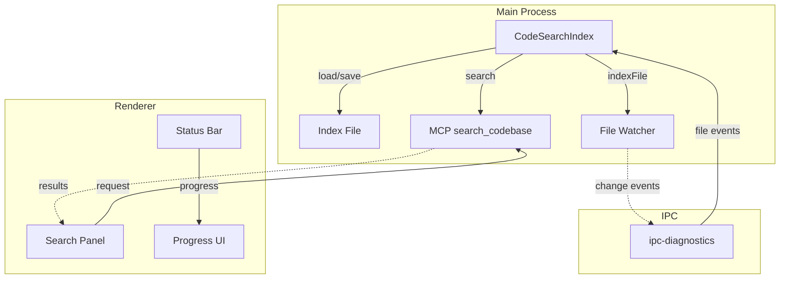

# Search/Codebase Indexing Improvements

## Problem Statement

Current search implementation has these issues:
- **Cold start ~2-5s** on large projects (full re-index on every session)
- **No persistence** - index is rebuilt from scratch each time
- **No live updates** - new/changed files require re-index
- **No progress feedback** - user sees no indication during indexing

## Goals

1. **Persist index to disk** - Load existing index on startup, only update changed files
2. **Background indexing** - Show progress indicator during indexing
3. **Live incremental updates** - File watcher updates index on save
4. **Faster subsequent launches** - Near-instant search after first index

---

## Implementation Plan

### Phase 1: Index Persistence to Disk

**File location**: `.pipilot/search-index.json`

**Data structure**:
```json
{
  "version": 1,
  "workDir": "/path/to/project",
  "lastModified": 1715623012000,
  "files": {
    "src/index.ts": {
      "hash": "abc123",
      "indexedAt": 1715623012000,
      "chunkCount": 5
    }
  },
  "invertedIndex": { "token": ["docId1", "docId2"] },
  "documents": { "docId": { "file": "src/index.ts", "startLine": 1, "termFreqs": {} } },
  "stats": { "totalDocs": 150, "avgDocLength": 25 }
}
```

**Changes to search-index.js**:
1. Add `load()` method - load index from JSON file
2. Add `save()` method - serialize to JSON file  
3. Add `needsReindex()` - compare file hashes to detect changes

### Phase 2: Background Indexing with Progress

**UI Elements**:

| Location | Element ID | Shows | States |
|----------|----------|-------|---------|
| Status bar | `#status-index` | Search status | `Search: ready` / `Search: indexing 45%` / `Search: updated` |
| Search panel | Progress bar | During initial index | 0-100% with file count |
| Toast | Notification | On complete | "Search index ready" |

**Status bar layout** (left side, after branch):
```
⎇ main  Search: ready  ✕ 0  ⚠ 0  |  Ln 1, Col 1  Plain Text  ⌨
```

**Search panel progress bar**:
```
┌─────────────────────────────┐
│ Indexing... 45%         │
│ ████████████░░░░░░░░░░  │
│ 135 files of 300 indexed  │
└─────────────────────────────┘
```

**Implementation**:
1. Add `indexProjectWithProgress()` method returning progress events
2. Update every YIELD_EVERY files processed
3. Emit progress to renderer via IPC

### Phase 3: Live Incremental Updates via Chokidar

**Integration with existing diagnostics watcher** (`ipc-diagnostics.js`):
- Reuse existing chokidar watcher
- On file change: call `index.indexFile(filePath)`
- On file delete: call `index.removeFile(filePath)`
- Debounce rapid changes (100ms)

**Code changes**:
1. Export index instance from mcp-ide-tools.js
2. Wire file events from diagnostics watcher
3. Update mcp-ide-tools to register callbacks

---

## Architecture



---

## File Changes

| File | Changes |
|------|--------|
| `main/search-index.js` | Add load/save, progress events, needsReindex |
| `main/mcp-ide-tools.js` | Add persistence loading, watch callbacks |
| `main/ipc-diagnostics.js` | Export file change events |
| `renderer/sidebar.js` | Show indexing progress in search panel |
| `renderer/statusbar.js` | Show index status |
| New: `main/ipc-search-index.js` | Dedicated IPC handlers for search index |

---

## Success Criteria

- [ ] First launch: index completes with progress indicator
- [ ] Second launch: index loads in <500ms
- [ ] File changes: index updates within 500ms
- [ ] Search works during background indexing (returns partial results)
- [ ] No UI freeze during indexing